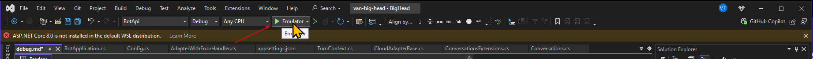
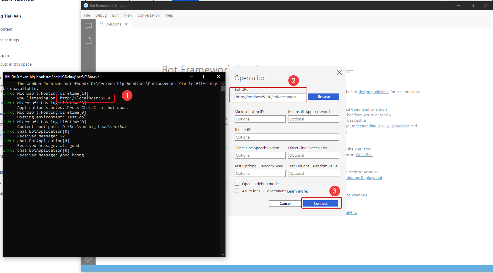
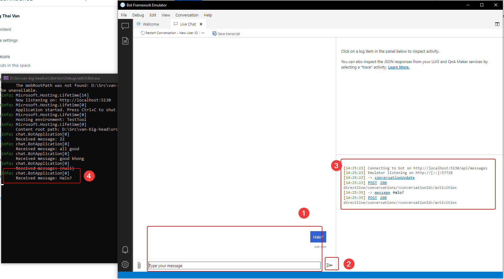

This is how to test the BotApi using an emulator channel.

1/ Start BOT API using the `Emulator` profile.

2/ Start `Bot Framework Emulator` with the following configuration. Click `Connect`.

3/ Test connection.

## Known issue

1/ The API throws the error "No Authentication header".

You must make sure the `BOT_ID` and `BOT_PASSWORD` be empty in the `appsettings.json`, `appsettings.Emulator.json`, and `secret.json` (if you are using User Secret).