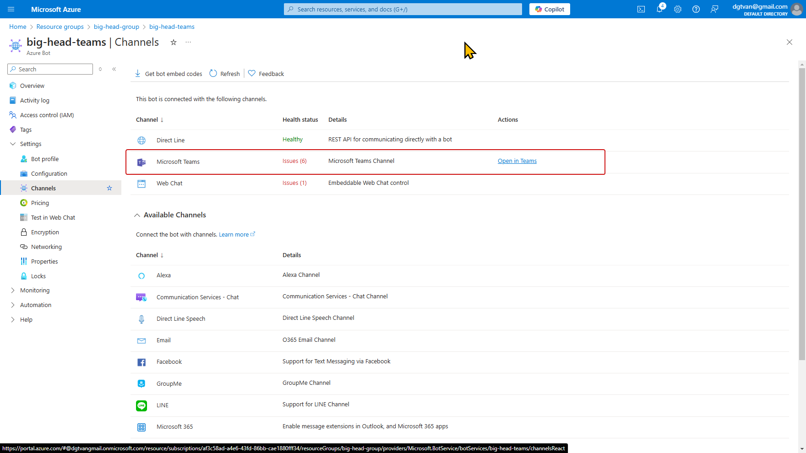

This guideline provides an overview along with a complete basic setup to help us successfully run a bot.

The steps in this guideline should be followed in order, from top to bottom.

# Overview

A complete bot consists of three components:
* `Bot App`: It is a zip package containing manifest files. The package is installed on the MS Teams client.
* `Azure Bot Service`: A bot must have an identity managed by the [Azure Bot Service](https://azure.microsoft.com/en-us/products/ai-services/ai-bot-service).
* `Bot API`: It listens as well as reponds to the events comming from the Bot App. It is where we implement our business logics. We can host it anywhere, however, when we follow Microsoft tutorials out there,
they usually give steps to host the Bot API on Azure service, we might think it is a must but it is not.

This guideline will guide us to setup these 3 componets, wire them together, and demo a simple use case.

# Prepare development environment

We will be using Visual Studio as the primary IDE for this project. It is recommended to install the required components so that we can easily follow the guidelines.

* Install Visual Studio 2022, and the version must be 17.6 or later
* Install the component `ASP.NET and web development` with the optional package `Microsoft Teams development tools`

# Register an Azure Bot Service

Find the Azure bot service

Create an Azure bot with options:
* `Bot handle`: A unique identity of the bot. I choose `big-head-teams`.
* `Resource group`: It is where you want to put your bot app which is the one we are creating. We can create a new group for it, that is totally fine. I decide to create a new one with the name `big-head-group`.
* `Pricing tier`: Choose `Standard` plan. It also offers `Premiumm` plan with other advantages, check [the pricing page](https://azure.microsoft.com/en-us/pricing/details/bot-services/) for more. For now the Standard plan is enough.
* `Type of app`: Choose `Multi Tenant`
* `Creation type`: Choose `Create new Microsoft App ID`

#### App ID and App Password

After creating an Azure bot, open the resource group `big-head-group`, and look for our bot `big-head-teams`.

Open it, and go to the section `Configuration`. 
* Now, we need to remember the value of `Microsoft App ID`.
* We also need to create a password coresponding to the `Microsoft App ID`, lets click on the `Manage Password`.

Click `New client secret`, a new panel appears on the right, lets choose a descriptive name for the password, then click `Add`.

After that, the new secret will be created and showing along with the value.
* We need to remember the secret value.
* Importantly, it will never be viewed again. If we loose it, we will need to create a new one.

At this point, the two important values we need to remember are:
* the `Microsoft App ID`
* and the scecret we just created, lets call it `Microsoft App Password`

#### Enable MS Teams channel

In order to allow events from MS Teams, we need to enable MS Teams channel.

Lets go to the section `Channels`, click `Microsoft Teams` in the Available channel list.

and click `Apply` anway, leave all options as they are.

after that, we should see `Microsoft Teams` in the Channel list.

# Setup Bot API

### Setup Dev Tunnels
It is only required when we want to run Bot API locally. It helps to expose the Bot API to internet, so that Azure Bot Service can talk with the Bot API.

It can run standalone, however, we use Visual Studio to develop, it is more convinient to have Dev Tunnels integrated with Visual Studio.

If we prepared the development environment properly following the section `Development environment`, Dev Tunnels should be installed as well.

Lets open the Dev Tunnel window.

Create a tunnel.
* `Name`: We can select any favorite name.
* `Tunnel Type`: Choose `Persistent`. If we choose `Temporary`, the Dev Tunnel will create a new random public url each time we start the tunnel, then we have to update our related configurations. Check out more on [the difference between the two options](https://learn.microsoft.com/en-us/aspnet/core/test/dev-tunnels?view=aspnetcore-9.0#persistent-versus-temporary-tunnels).
* `Access`: Choose `Public`. For ease of setup for now. We will explore more on it later.

Now the tunnel is ready, but not started yet. Lets continue to the section `Setup Bot API`, we will see how it gets to work.

### Setup Bot API

There are different approaches to build a Bot API, each approach provides a different set of features.

This guideline is based on the big-head bot, the purpose of the bot is to provide an AI-based assistances to MS Teams users. [Teams AI library](https://learn.microsoft.com/en-us/microsoftteams/platform/bots/how-to/teams-conversational-ai/teams-conversation-ai-overview?tabs=javascript%2Cjavascript1#why-use-teams-ai-library) is the best choice for the given purpose at the moment.

We can start a new project in Visual Studio using the template `Microsoft Teams App`

Enter our project name, then select bot type `AI Chat Bot`. I will generate two projects, one is a Bot API, another is a Bot App.

Or we use the big-head's code in its early stage as the base code, check out the directory `BotApi` in [this commit](https://github.com/dgtvan/big-head/commit/d94b10bc9151f020ffd5b2185bb3b8b2699a30f6#diff-efd98e0498e407e3f51719f80105b068a0e2d59bc376d4f55c1735b4a376d68a).

Somehow, the Visual Studio could not compile successfully, we should get started using the big-head's code.

#### Database

The big-head's code was set up to store conversations between MS Teams users and the bot, so it requires to have a `MSSQLLocalDB`

Create a database named `BotDb` and execute [the script to create the database schema](https://github.com/dgtvan/big-head/blob/d94b10bc9151f020ffd5b2185bb3b8b2699a30f6/src/BotApi/Databases/Scripts/database-schema.sql). The database is not ready.

#### Secrets

The Bot API has been set up to use User Secrets, so open he project's user secrets and enter the secrets we created in the section [Register an Azure Bot Service](#Register-an-Azure-Bot-Service)
* `BOT_ID`: It is the `Microsoft App ID`
* `BOT_PASSWORD`: It is the `Microsoft App Password`

After that, we select the created dev tunnel, and then start the project with the profile `Development`.

Now, we should see a console window indicating that our bot is running, and the dev tunnel's status is now `Started`. Lets get the dev tunnel public url which is required for the next section [Setup Bot App](##Setup-Bot-App).

#### Azure Bot Service

Lets go back to Azure bot service for a moment, open the section `Configuration` and enter the bot api public url into the field `Messaging endpoint`, and click `Apply`.

The bot api public url is the tunnel public url followed by `/api/messages` which matches the Bot API endpoint and the Bot API's ein the controller `.\src\BotApi\Controllers\BotController.cs`.

If we want to change that url, make sure it is updated in either the Azure Bot Service' messaging endpoint and the Bot API controller.

# Setup Bot App

We can start a new project in Visual Studio using the template `Microsoft Teams App` with the bot type `AI Chat Bot` as described in the section `Setup Bot API`.

Or we use the big-head's code in its early stage as the base code, check out the directory `BotTeams` in [this commit](https://github.com/dgtvan/big-head/commit/d94b10bc9151f020ffd5b2185bb3b8b2699a30f6#diff-efd98e0498e407e3f51719f80105b068a0e2d59bc376d4f55c1735b4a376d68a).

Open the two files `.env.local` and `.env.local.user`. We need to configure the following variables.
* `BOT_ID`: It is the `Microsoft App ID` from the section [Register an Azure Bot Service](#Register-an-Azure-Bot-Service)
* `TEAMS_APP_ID`: It is the same as `BOT_ID`
* `SECRET_BOT_PASSWORD`: It is the `Microsoft App Password` from the section [Register an Azure Bot Service](#Register-an-Azure-Bot-Service)
* `BOT_DOMAIN`: It is the tunnel public url from the section [Setup Bot API](####Setup-Bot-API). Important: Enter the domain only, do not include the protocol `https://`.

Of course, we can configu the bot's name, description,...etc in the package manifest file `manifest.json`. The bot icons are located in the same place with the manifest file as well.

Necessary configurations were done. Now we can create MS Teams bot package. Lets open the the packing toolkit, and select the manifest file.

We can see the packaging result with a full path the package in the Output window.

We now need to upload the bot package to MS Teams locally. Lets open MS Teams, navigating to the app upload screen, and upload the bot package we just built.

If no any errors, we should see the popup showing our bot details, we should click `Add` and will see our bot in the app list. The setup has been done.

# Demonstration

Open MS Teams, and create a new chat with the bot.

Send a message, we should get an echo from the bot.

Open SSMS, and query the conversation logs, we should see the conversation has been stored there.

